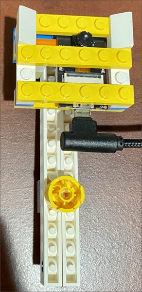
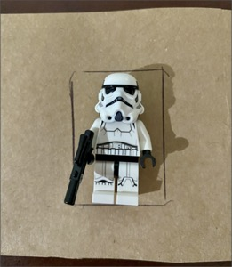
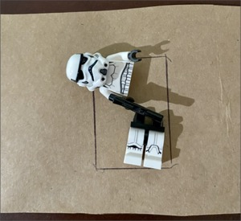

# Set up the ESP-EYE to share images via a web server

In the [previous step](./hello-world-esp-eye.md) you configured your computer to program the ESP-EYE, and create your first 'Hello World' program running on the board.

In this step you will set up the ESP-EYE to share images via a web server.

## Gather images

The end result of this lab is to create an AI powered QA system for a prototype assembly line. To train this AI, you will need a set of sample images of the item being manufactured in both a successful and failed state. Ideally these images should be taken by the device that will take the images for the actual validation so that the training set is as close to the real data as possible.

The best way to do this is to set up the assembly line, and take photos with the ESP-EYE. These photos will then be able to be downloaded from the device ready to train the model.

## Build the assembly line

For this prototype, you will need a setup where the ESP-EYE can be held in a position where it can see items coming through the 'assembly line'. Nothing actually needs to move, you don't need a working assembly line, you just need a way to put items in a known position so the ESP-EYE can take a picture.

### An example assembly line

One example setup uses Lego to hold the ESP-EYE, and cardboard as a backdrop for the item on the assembly line. The item being assembled is a Lego MiniFig. The advantage of using a lego character is that it is easily split apart to get images for a pass (complete MiniFig) and fail (MiniFig in 2 parts).

> You don't need to use lego, I just happened to have plenty lying around. You can use anything that can hold the ESP-EYE.

#### A holder for the ESP-EYE

The holder for the ESP eye takes advantage of the fact that the camera is one Lego stud tall, meaning it can be help using a few Lego planks.

#### The assembly line frame

The assembly line frame is made of more lego, holding the camera pointing straight down.

The bed of the assembly line is cardboard, with lines to indicate where the frame fits over the top, and a rectangle to show where the MiniFig needs to set to be photographed.

#### The item being assembled

This assembly line assembles MiniFigs. A successful assembly is a complete MiniFig, a fail is a MiniFig in two parts.

### Construction

Use whatever you have to hand to build an assembly line. The requirements are:

* The ESP-EYE needs to be held in a way where it can't easily move and can point at the item on the assembly line, and the USB port is accessible. Make sure a USB cable is fitted when you assemble.
* There is enough light for the camera to see the item on the assembly line - the camera on the ESP-EYE is not the best in low light
* The backdrop for the item is consistent
* Items can be positioned in roughly the same location on the assembly line

A simple option would be a cardboard box with a hole in the top for the camera, the ESP-EYE fixed on top using poster tack, and the sides of the box cut out to let light in.

For the item being assembled anything will do as long as it can be configured into pass and fail. You could even have an assembly line for candy like M&Ms where a pass is two M&Ms, and a fail is one or none.

## Next steps

In this step you set up the ESP-EYE to share images via a web server.

In the [next step](./build-image-classifier.md) you will build an image classifier using Azure Custom Vision
