# Create the application using Azure IoT Central

In the [previous step](./SetUpTheEnvironmentMonitor.md) you assembled the hardware, and set up the Pi. In this step, you will create the app in Azure IoT Central.

## Create your first Azure IoT Central app

[Azure IoT Central](https://azure.microsoft.com/services/iot-central/?WT.mc_id=iotcurriculum-github-jabenn) is an IoT Software-as-a-service (SaaS) platform. This allows you to define an service that can interact with IoT devices, sending data both ways from device to cloud, and cloud to device. You can define the capabilities of each device, and create dashboards to show data.

To create your app, you can either create it manually from scratch to learn about how to build Azure IoT Central apps, or create it from a pre-defined template if you want to save time and already know how to use Azure IoT Central.

### Create the app from a template

1. Follow this link to create a new Azure IoT Central app pre-configured for this workshop:

   [apps.azureiotcentral.com/build/new/c136de48-e7a1-4f3d-83d1-05a8cbfa63ed](https://apps.azureiotcentral.com/build/new/c136de48-e7a1-4f3d-83d1-05a8cbfa63ed)

1. Sign in with your Microsoft account if needed

1. Give your application a name that makes sense to you, such as `Agro Hack`

1. Provide a unique URL for your app. This needs to be globally unique, so include things such as the date or your name. For example `agrohackjim2020`.

1. Select a pricing plan. This hack only uses 2 devices, so is free for all tiers, so select the one that makes sense for you. The Free tier is ideal as long as you don't want your code to run longer than 7 days.

    For the free tier you will need to provide a name and phone number, that will be verified. For the other tiers you will need an Azure subscription. You can find details on different free subscriptions [here](https://github.com/jimbobbennett/AgroHack/blob/master/README.md#azure-account).

1. Select **Create**

Your application will be provisioned, and you will see the dashboard once it is ready.

Head to [Create a device](#create-a-device) to configure a device inside the Azure IoT Central app.

### Creating the app manually

#### Provision the app

1. Head to [apps.azureiotcentral.com](https://apps.azureiotcentral.com/?WT.mc_id=iotcurriculum-github-jabenn)

1. From the menu on the side, select **Build**

1. Select **Custom Apps**

1. Sign in with your Microsoft account if needed

1. Fill in your application details:
    1. Give your application a name that makes sense to you, such as `Agro Hack`
    1. Provide a unique URL for your app. This needs to be globally unique, so include things such as the data or your name. For example `agrohackjim2020`.
    1. Leave the Application Template as `Custom Template`
    1. Select a pricing plan. This hack only uses 2 devices, so is free for all tiers, so select the one that makes sense for you. The Free tier is ideal as long as you don't want your code to run longer than 7 days.

       For the free tier you will need to provide a name and phone number, that will be verified. For the other tiers you will need an Azure subscription. You can find details on different free subscriptions [here](https://github.com/jimbobbennett/AgroHack/blob/master/README.md#azure-account).

    1. Select **Create**

Your application will be provisioned, and you will see the dashboard once it is ready.

#### Define the device template

Azure IoT Central can work with multiple types of device, and multiple devices per device type. Device types are defined using templates - these specify the capabilities of the device including the telemetry that can be received from the device, and commands that can be sent to it.

The environment sensor captures temperature, humidity, air pressure and soil moisture. You will need to define a template that has these values on it, so they can be received from the Pi. It can also receive a message indicating that the plant needs watering and use this to turn on an LED, so the template will need to support this via a command.

1. From the left-hand menu, select **Device Templates**

   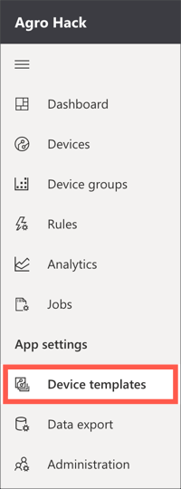

1. Select the **+ New** button from the top menu

   

1. Select the **IoT Device** template

   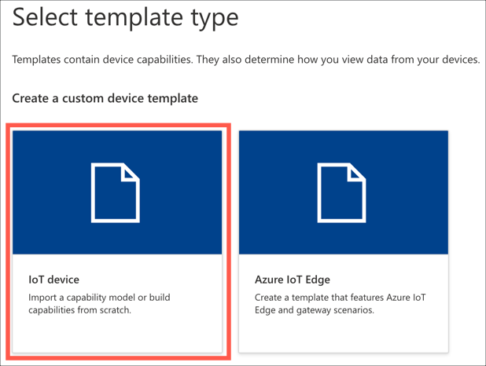

1. Select the **Next: Customize** button

1. Select the **Next: Review** button

1. Select the **Create** button

1. Name the template `Environment Sensor`

Once the template is created, you need to add capabilities to it. These are defined using **capability models**, which define the capabilities of all devices that will use this template. Capability models are made up of three parts:

* **Interfaces** - these are reusable collections of capabilities, and are grouped into three categories:

   1. **Telemetry** - actual values detected and sent by the device, for example in a thermostat it could be the current detected temperature

   1. **Properties** - settings on the device, for example in a thermostat it could be the desired temperature. These can be set by the device, or via Azure IoT Central and synced to the device.

   1. **Commands** - calls that can be made on the device, optionally passing data. For example in a thermostat it could be called by a mobile app to send a request to change the desired temperature.

* **Cloud properties** - these are properties set in Azure IoT Central against a device, but not synced to the device. For example a device could have a cloud property for the account name of the owner, the devices location, or the date it was last serviced.

* **Views** - these are dashboards for a device that can contain charts, data values and other information allowing you to visualize telemetry or send commands.

The environment sensor needs a capability model created, with an interface defined for the telemetry values being sent, a command to indicate that the plant needs watering, and a view to visualize these values.

1. Select the **Custom** capability model

   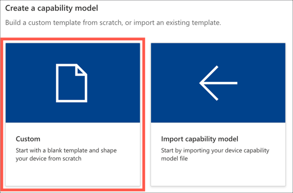

##### Add an interface

1. Add a new interface to the capability model by selecting the top level *Environment sensor* item in the menu and selecting **+Add interface**

   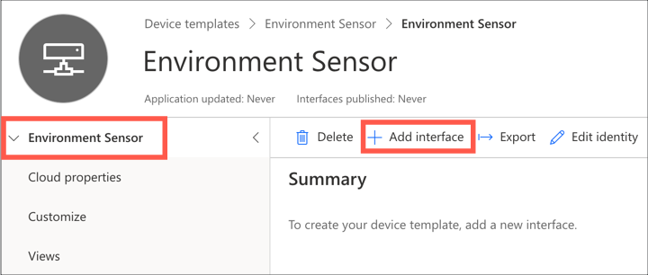

1. Select **Custom**

   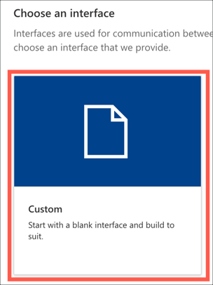

This interface needs 4 telemetry values added to it for the temperature, pressure, humidity and soil moisture. Telemetry values have the following properties:

* **Display name** - this defines what is shown on a view to display the value
* **Name** - this maps to the values being sent from the device
* **Capability type** - this defines what type of value this is, and includes some standard types such as temperature or pressure.
* **Schema** - this defines the data type for the value being received, such as an integer or a floating point number
* **Unit** - this defines the unit for know telemetry types, for example °C for temperatures.

1. Select the **+ Add capability** button to add new capabilities, and add the following four values:

   |  Display Name | Name          | Capability Type | Semantic Type | Schema | Unit |
   | ------------- | ------------- | --------------- | ------------- | ------ | ---- |
   | Temperature   | temperature   | Telemetry       | Temperature   | Double | °C   |
   | Pressure      | pressure      | Telemetry       | Pressure      | Double | kPa  |
   | Humidity      | humidity      | Telemetry       | Humidity      | Double | %    |
   | Soil Moisture | soil_moisture | Telemetry       | None          | Double | None |

   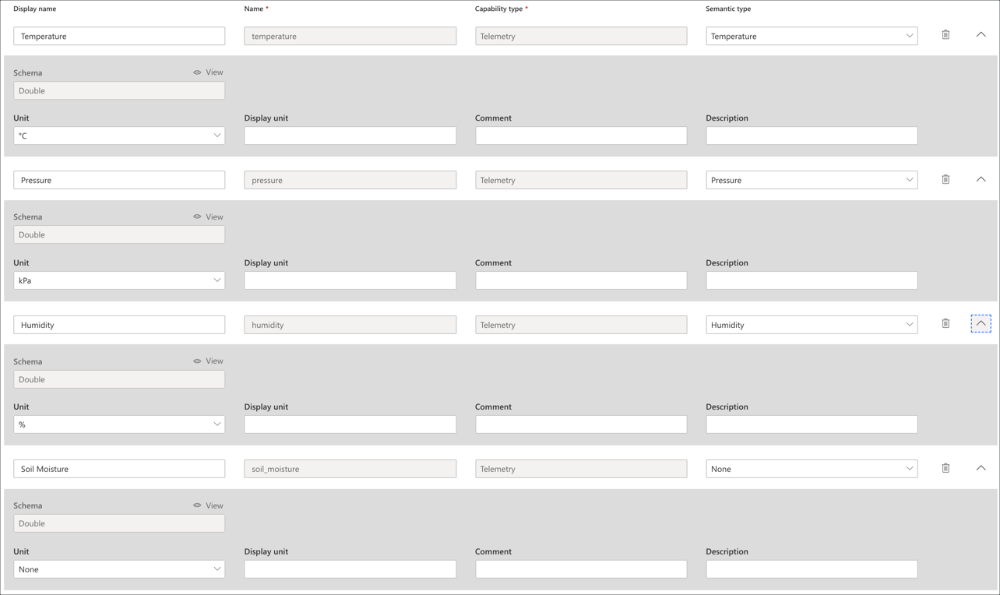

The interface also needs a command that can be triggered to indicate that the plant needs watering.

1. Select the **+ Add capability** button to add one more new capability, and add the following value:

   |  Display Name  | Name           | Capability Type |
   | -------------- | -------------- | --------------- |
   | Needs Watering | needs_watering | Command         |

1. Turn on **Request** for the command and set the following values:

   |  Display Name  | Name           | Schema  |
   | -------------- | -------------- | ------- |
   | Needs Watering | needs_watering | Boolean |

   

1. Select the **Save** button from the top menu

   

##### Add a view

A view is used to visualize this telemetry, and this needs to be added to the capability model.

1. Select **Views** from the menu

   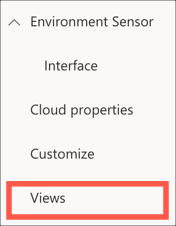

1. Select **Visualizing the device**

   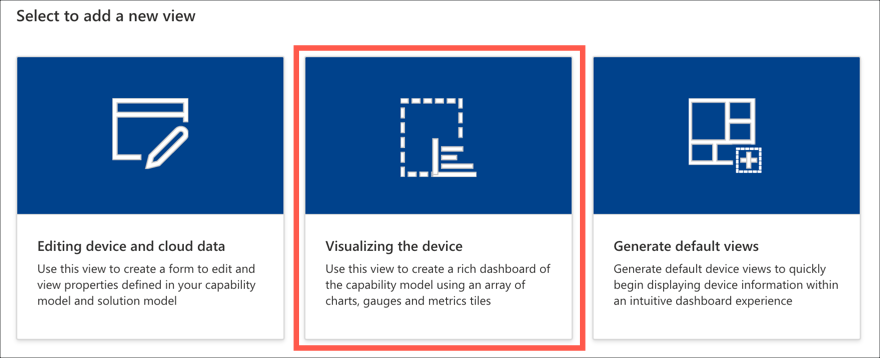

1. Set the view name to `Environment Monitoring`

   

1. Drag *Temperature* from the *Telemetry* section onto the dashboard. This will add a graph showing the temperature recorded over the past 30 minutes to the dashboard. You can configure this in multiple ways using the control buttons on the top of the panel:

    Change the visualization to be a number of different chart types, or the last known value

    Change the size of the panel on the dashboard

    Configure the chart including legend, axis labels and the time range

   Configure the chart or last know value to your liking.

1. Repeat this for the other telemetry values. If you want to plot multiple telemetry values on the same chart use the check boxes to select multiple values and drag them together. You can add telemetry values multiple times to get multiple views over the data.

1. Drag *Needs Watering* from the *Command* section onto the dashboard.

1. You can also customize the view with labels, markdown or images if desired.

1. Select the **Save** button from the top menu

   

When done you will have a view that will look something like this, depending on how you designed it:

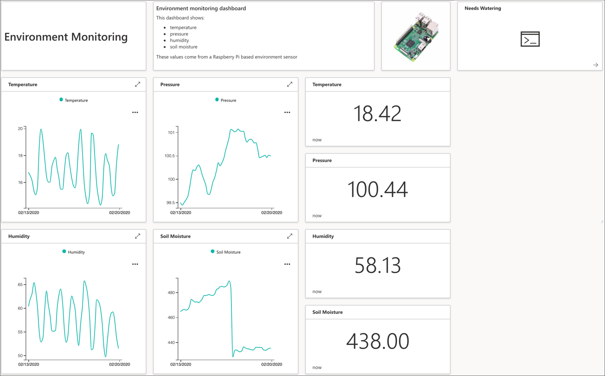

#### Publish the device template

Before the device template can be assigned to a device, it needs to be published. Once published, any interfaces defined on it cannot be changed, instead a new version of the device template needs to be created.

1. Select the **Publish** button from the top-most menu

   

1. Select **Publish**

   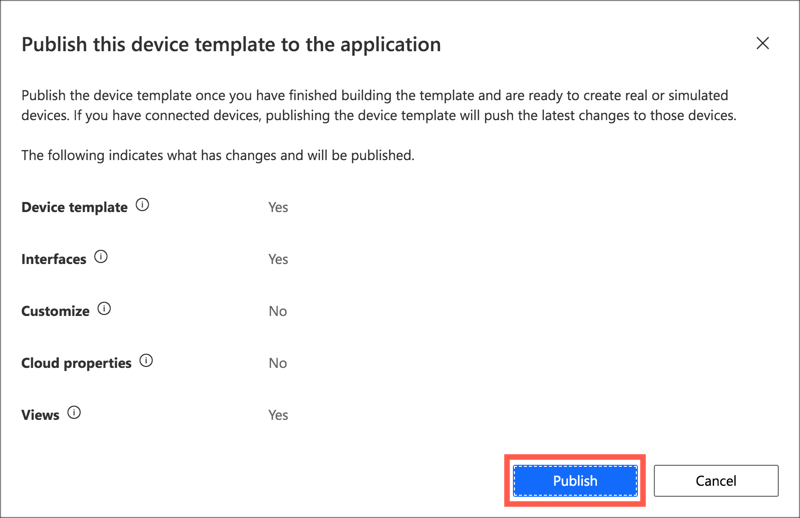

## Create a device

Device templates can be assigned to one or more devices - a device being an actual physical device or a software simulator. The Raspberry Pi that was set up in the last step will be added as a device and configured to use the new device template.

### Create a new device

1. Select **Devices** from the left-hand menu

   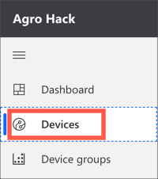

1. Select the **Environment Sensor** device template in the template list

   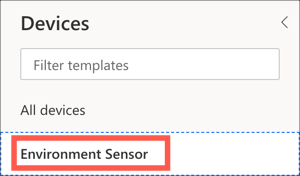

1. Select **+ New**

   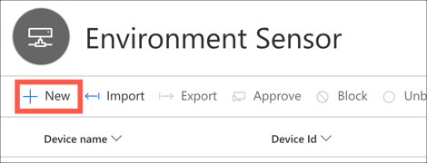

1. Set the *Device Id* to `raspberry_pi`, the *Device Name* to `Raspberry Pi`. Then select **Create**

   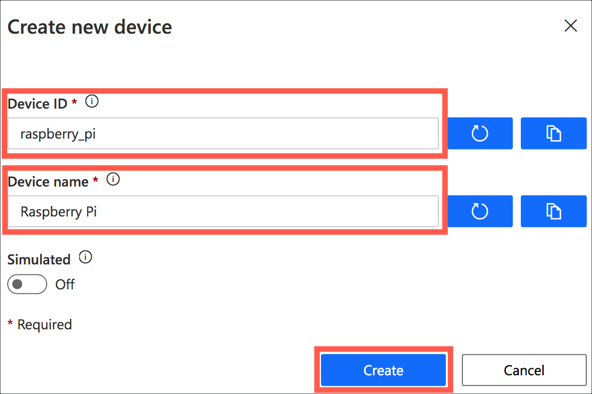

The new device will appear in the devices list.

### Get the device connection details

Each device has a set of connection details that will be used on the actual device to connect to Azure IoT Central and send telemetry.

1. Select the `Raspberry Pi` device in the devices list. This will show the view created earlier with all the telemetry boxes marked as *Waiting for data*.

   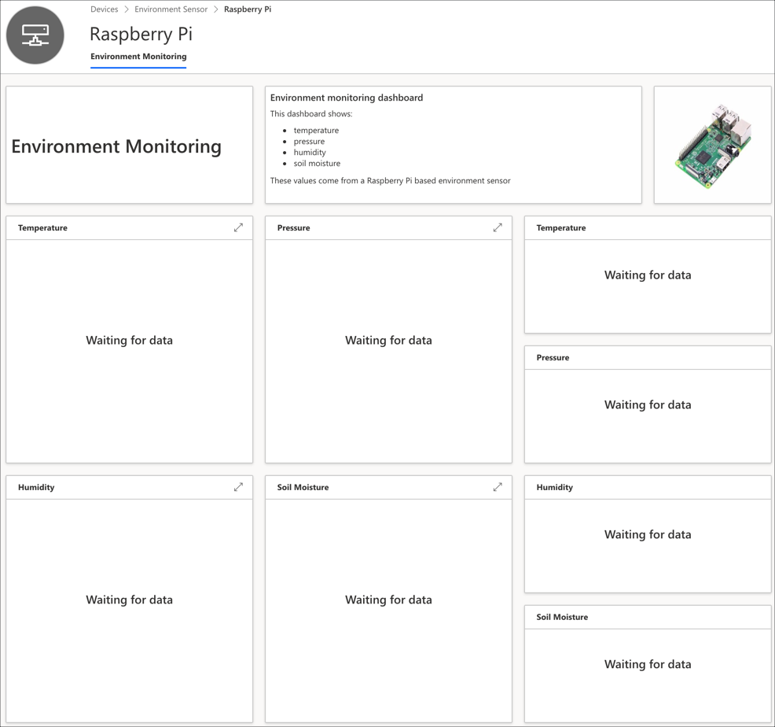

1. Select **Connect**

   

1. Take a note of the *ID Scope*, *Device Id* and *Primary key* as you will need these values in the next step

   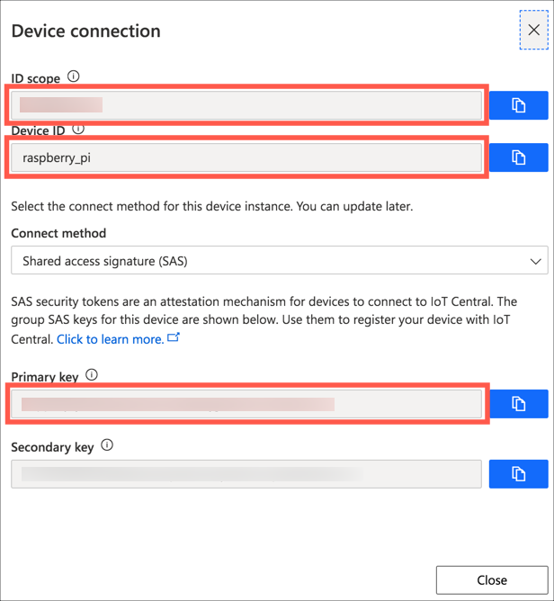

In this step, you created the app in Azure IoT Central. In the [next step](./WriteThePiCode.md) you will write the code to capture telemetry from the Raspberry Pi.
